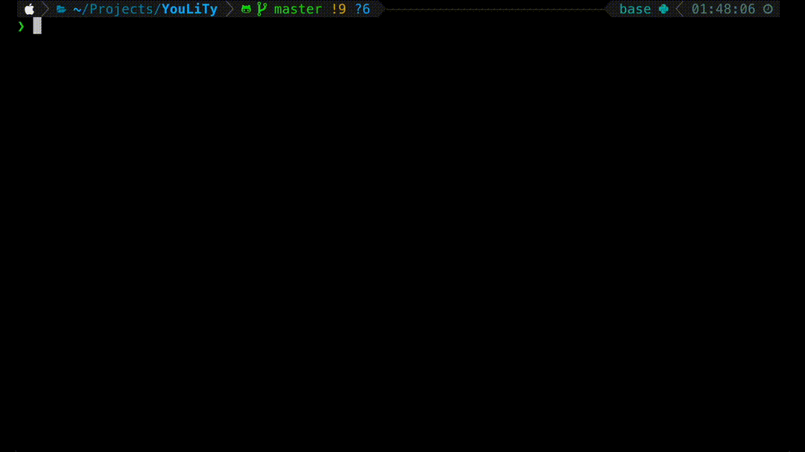

# LiTy: Listen &amp; Type

**An Efficient Dictation Training Tool for English Learners.**

Train your "human brain speech recognition".

Note: If you need the previous version that supports MP3 audio files with transcripts and forced alignment, please check out the commit [711f824](https://github.com/voidism/LiTy/tree/711f824a9fb799196f0ddc46ad3518191ad4a922). The current version is more user-friendly and supports any YouTube video with subtitles. No need to install gentle and run forced alignment anymore.

## Features
- Support any YouTube video with subtitles.
- Play segments again and again until you complete the whole sentence.
- Visualize the errors in your answer.
- Record statistics (error rate, speed) for personal reviewing.
- Provide explanations for the sentence via GPT-4o (OpenAI API required).

## Example



- To practice dictation, all you need is a Youtube video link (which needs to have subtitles). The tool will automatically download the audio and subtitle files.
- When typing sentences, the audio segment will be played repeatly with a 2.5-second pause time. Your can also specify the pause time.
- A visualization of edit distance will be shown after submit your answer. This feature are supported by [visedit](https://github.com/ukiuki-satoshi/visedit/). We modified the code of visedit a bit and used [python-Levenshtein](https://github.com/ztane/python-Levenshtein/) to speed up this module.
- The feedback information will be show and recorded in a log file, including **accuracy** and **word speed per listen iteration**.
- If you have a OpenAI API key, you can enable the explanation function to make GPT-4o help you understand the sentence.

## Setup

### Install required packages:

- pydub
- pyaudio
- tqdm
- python-Levenshtein
- yt-dlp

```
pip install -r requirements.txt
```

## Usage

```
usage: main.py [-h] [--log_dir LOG_DIR] [--data_dir DATA_DIR] [--pause_time PAUSE_TIME] [--char_per_sent CHAR_PER_SENT]
               [--openai_key OPENAI_KEY] [--lang LANG]
               link

positional arguments:
  link                  the link of the YouTube video with subtitles.

options:
  -h, --help            show this help message and exit
  --log_dir LOG_DIR     the folder to save the log file.
  --data_dir DATA_DIR   the folder to save the downloaded data.
  --pause_time PAUSE_TIME
                        the pause time in seconds between each audio replay.
  --char_per_sent CHAR_PER_SENT
                        number of maximum characters should be included in a sentence.
  --openai_key OPENAI_KEY
                        the OpenAI API key. (optional. if not provided, the explanation function will be disabled.)
  --lang LANG           the language of the GPT-4o explanation. options: en, zh.
```

```
example: python main.py "https://www.youtube.com/watch?v=mfQZJC5HyVo"
```

- When running the script second time with the same `--link`, `--data`, the tool will skip the downloading process and directly start the practice.
- When running the script second time with the same `--link`, `--log_dir` and `--char_per_sent`, the tool will resume the practice from the last sentence in the log file.
- The log file will be in tsv format to record `practice time, audio file name, sentence number, accuracy, word speed/iter, hypothesis, target`
- We will show emojis to indicate the accuracy of the answer, as well as the word speed per iteration.
- The emoji meaning for accuracy is as follows:
  - 💯: 95%~100%
  - 👏: 90%~95%
  - 👍: 80%~90%
  - 👌: 70%~80%
  - 👀: 60%~70%
  - 🤔: 50%~60%
  - 🤨: 40%~50%
  - 😒: 30%~40%
  - 😞: 20%~30%
  - 😭: 10%~20%
  - 🤬: 0%~10%
- The emoji meaning for word speed per iteration is as follows:
  - 🚀: >4.5
  - 💨: >4.0
  - 🏃‍♂️: >3.5
  - 🐇: >3.0
  - 🐢: >2.0
  - 🐌: <=2.0
- We will show the statistics of the occurrence of each emoji when exiting the practice.
- If you have a OpenAI API key, we can provide the explanation of the sentence via GPT-4o. The explanation will be shown after you submit your answer. The explanation will be in English in default. If you want to use the Chinese explanation, please specify `--lang zh`. Please run `pip install openai` to use this feature.

## License

MIT